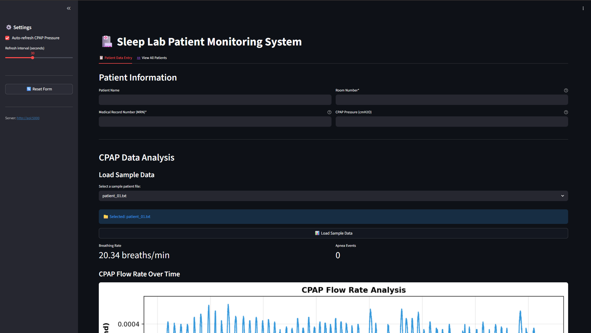

# Sleep Lab Monitoring System

[](https://cpap-cpap-o85eb8-d30a0e-72-61-1-6.traefik.me)


<!-- LOGO placeholder: Consider adding a medical monitoring or sleep study related icon/logo here -->

A comprehensive patient monitoring system designed for sleep labs to track CPAP therapy data, analyze breathing patterns, and detect apnea events in real-time.

## 📖 Table of Contents

- [About The Project](#about-the-project)
- [Key Features](#key-features)
- [Built With](#built-with)
- [Getting Started](#getting-started)
  - [Prerequisites](#prerequisites)
  - [Installation](#installation)
- [Usage](#usage)
  - [Running the Server](#running-the-server)
  - [Launching the Patient GUI](#launching-the-patient-gui)
  - [Configuration](#configuration)
- [API Documentation](#api-documentation)
- [Testing](#testing)
- [Docker Deployment](#docker-deployment)
- [Roadmap](#roadmap)
- [License](#license)
- [Contact](#contact)

## About The Project


<!-- Screenshot suggestion: A side-by-side view of the patient GUI with CPAP data graphs and the monitoring interface -->

Sleep apnea affects millions of people worldwide, and effective monitoring of CPAP therapy is crucial for patient outcomes. This system was built to streamline the collection, storage, and analysis of CPAP data in sleep lab environments.

The Sleep Lab Monitoring System provides:
- **Real-time patient monitoring** with automatic CPAP pressure updates
- **Advanced signal processing** to detect breathing anomalies
- **Intuitive GUI interface** for clinical staff to manage patient data
- **RESTful API architecture** for easy integration with existing hospital systems

### Key Features

- ✅ **Patient Data Management**: Track patient information including MRN, room assignments, and CPAP pressure settings
- ✅ **CPAP Data Analysis**: Automatically processes pressure sensor data to calculate breath rate, flow patterns, and apnea events
- ✅ **Apnea Detection**: Identifies breathing gaps exceeding 10 seconds using advanced signal processing (scipy.signal.find_peaks)
- ✅ **Visual Flow Graphs**: Generates real-time volumetric flow vs. time plots for clinical assessment
- ✅ **Automated Polling**: GUI polls server every 30 seconds for CPAP pressure updates
- ✅ **Room-Based Updates**: Monitoring stations can push CPAP pressure changes to specific patient rooms
- ✅ **SQLite Database**: Persistent storage with SQLAlchemy ORM for reliable data management

### Built With


**Core Technologies:**
- **[Flask](https://flask.palletsprojects.com/)** - RESTful API server framework
- **[SQLAlchemy](https://www.sqlalchemy.org/)** - SQL toolkit and ORM
- **[Tkinter](https://docs.python.org/3/library/tkinter.html)** - GUI framework for patient interface
- **[SciPy](https://scipy.org/)** - Signal processing for CPAP data analysis
- **[Matplotlib](https://matplotlib.org/)** - Data visualization and flow graph generation
- **[NumPy](https://numpy.org/)** - Numerical computing for pressure/flow calculations
- **[Streamlit](https://streamlit.io/)** - Interactive monitoring dashboards
- **[Pytest](https://pytest.org/)** - Testing framework with pycodestyle enforcement

## Getting Started

Follow these steps to set up the Sleep Lab Monitoring System in your local development environment.

### Prerequisites

Ensure you have the following installed:

- **Python 3.10 or higher**
  ```bash
  python --version
  ```

- **pip** (Python package installer)
  ```bash
  pip --version
  ```

### Installation

1. **Clone the repository**
   ```bash
   git clone https://github.com/yourusername/final-project-talyajeter_jasontran.git
   cd final-project-talyajeter_jasontran
   ```

2. **Create a virtual environment** (recommended)
   ```bash
   python -m venv venv

   # On Windows
   venv\Scripts\activate

   # On macOS/Linux
   source venv/bin/activate
   ```

3. **Install dependencies**
   ```bash
   pip install -r requirements.txt
   ```

4. **Initialize the database**

   The SQLite database (`patients.db`) will be automatically created when you first run the server.

## Usage

### Running the Server

Start the Flask REST API server on localhost:

```bash
python server.py
```

The server will start on `http://127.0.0.1:5000` by default. You should see output similar to:

```
 * Running on http://127.0.0.1:5000
 * Restarting with stat
```

### Launching the Patient GUI

In a separate terminal window (with your virtual environment activated):

```bash
python patient_GUI.py
```

The GUI window will open, allowing you to:

1. **Enter patient information** (MRN, name, room number)
2. **Set CPAP pressure** (4-25 cmH₂O)
3. **Upload CPAP data files** for analysis
4. **View calculated results**:
   - Breath rate (breaths per minute)
   - Apnea event count (highlighted in red if >1)
   - Flow vs. time graph
5. **Monitor pressure updates** from the monitoring station (polls every 30 seconds)

**Important GUI Behavior:**
- After the first upload, MRN and room number fields are locked to prevent accidental changes
- Use the **Reset** button to clear data and enter a new patient
- All data is automatically sent to the server and stored in the database

### Configuration

#### Server Connection

The patient GUI connects to the local server by default. To connect to a remote server, edit [patient_GUI.py](patient_GUI.py):

```python
# Local server (default)
server = "http://127.0.0.1:5000"

# Remote server (uncomment to use)
# server = "http://vcm-32579.vm.duke.edu:5000"
```

#### Database Configuration

The system uses SQLite with the database file `patients.db` stored in the project root. The schema is defined in [PatientModel.py](PatientModel.py) using SQLAlchemy ORM.

**Database Schema:**
- Primary Key: `room_number` (Integer)
- Fields: `patient_mrn`, `patient_name`, `CPAP_pressure`, `breath_rate`, `apnea_count`, `flow_image`, `timestamp`
- Arrays stored as JSON-encoded strings

#### Polling Interval

The GUI automatically polls the server every 30 seconds for CPAP pressure updates. To modify this interval, adjust the polling logic in [patient_GUI.py](patient_GUI.py).

## API Documentation

### Endpoints

#### `POST /add_patient`

Add or update patient information in the database.

**Request Body:**
```json
{
  "patient_name": "John Doe",
  "patient_mrn": "12345",
  "room_number": "101",
  "CPAP_pressure": "15",
  "breath_rate": "16",
  "apnea_count": "2",
  "flow_image": "base64_encoded_image_string"
}
```

**Response:**
- `200 OK`: "New patient created" or "Patient successfully updated"
- `400 Bad Request`: Validation error message

**Special Behavior:**
- If room exists with different MRN, the old patient is deleted and a new one is created
- Otherwise, new data is appended to existing patient's arrays

#### `GET /CPAP_query/<room_number>`

Query the latest CPAP pressure update for a specific room.

**Example:**
```bash
GET /CPAP_query/101
```

**Response:**
```json
{
  "CPAP_pressure": 18
}
```

#### `GET /new_cpap_pressure/<room_number>/<new_value>`

Push a new CPAP pressure value from the monitoring station to a patient's room.

**Example:**
```bash
GET /new_cpap_pressure/101/18
```

**Response:**
```json
{
  "message": "CPAP pressure updated",
  "room_number": 101,
  "new_value": 18
}
```

## Testing

The project uses pytest with pycodestyle enforcement for code quality and includes GitHub Actions CI/CD.

### Run All Tests

```bash
pytest -v --pycodestyle
```

### Run Specific Test Files

```bash
# Test server functionality
pytest test_server.py -v

# Test GUI validation logic
pytest test_patient_GUI.py -v

# Test repository setup
pytest test_github_check.py -v
```

### Run Single Test Function

```bash
pytest test_server.py::test_add_patient_handler -v
```

### Continuous Integration

The project includes GitHub Actions CI/CD pipeline that automatically runs tests on push and pull requests. See [.github/workflows/pytest_runner.yml](.github/workflows/pytest_runner.yml) for configuration details.

## Docker Deployment

This project includes full Docker support for easy deployment. The application runs two services: a Flask API server (with Gunicorn) and a Streamlit web interface.

### Architecture

```
┌─────────────────────┐         ┌─────────────────────┐
│   Streamlit Web     │────────▶│    Flask API        │
│   (Port 8501)       │         │    (Port 5000)      │
│                     │         │                     │
│ - Patient UI        │         │ - REST API          │
│ - CPAP Analysis     │         │ - SQLite Database   │
│ - Data Visualization│         │ - Patient Records   │
└─────────────────────┘         └─────────────────────┘
```

### Prerequisites

- Docker (version 20.10+)
- Docker Compose (version 2.0+)

### Quick Start

```bash
# Build and start both services
docker-compose up -d --build

# View logs
docker-compose logs -f

# Stop services
docker-compose down
```

Once running, access:
- **Web Interface**: http://localhost:8501
- **API Server**: http://localhost:5000
- **API Health Check**: http://localhost:5000/health

### Sample Data

The application includes 8 pre-loaded sample CPAP data files in [sample_data/](sample_data/) for demos and testing:

1. Navigate to the "Patient Data Entry" tab
2. Select "Use Sample Data"
3. Choose a sample patient file from the dropdown
4. Click "Load Sample Data" to analyze

### Common Docker Commands

```bash
# Rebuild a single service
docker-compose up -d --build api

# Restart a service
docker-compose restart api

# Shell access into a container
docker-compose exec api bash

# Run tests inside the container
docker-compose exec api pytest -v

# Check service status
docker-compose ps

# View resource usage
docker stats

# Full cleanup (removes volumes and images)
docker-compose down -v --rmi all
```

### Environment Variables

| Variable | Default | Description |
|----------|---------|-------------|
| `FLASK_ENV` | production | Flask environment |
| `API_URL` | http://api:5000 | API endpoint for Streamlit (internal Docker network) |
| `STREAMLIT_SERVER_PORT` | 8501 | Streamlit server port |

### Troubleshooting

**Port already in use:** Edit the `ports` mapping in [docker-compose.yml](docker-compose.yml) to use different host ports.

**Web can't connect to API:** The `API_URL` environment variable must be `http://api:5000` (Docker internal DNS), not `localhost`.

**Container won't start:** Check logs with `docker-compose logs api` or `docker-compose logs web`.

**Database issues:** Restart the API service with `docker-compose restart api`.

### Live Demo

Check out the video demonstration: [YouTube Demo](https://youtu.be/B9lVKJmEYy4)

## Roadmap

- [x] Patient data collection and storage system
- [x] CPAP data analysis with breath rate calculation
- [x] Apnea event detection (>10 second gaps)
- [x] Real-time flow graph generation
- [x] GUI with automatic polling for pressure updates
- [x] RESTful API with SQLite persistence
- [x] Docker deployment support
- [ ] Multi-room monitoring dashboard
- [ ] Historical data visualization and trends
- [ ] Email/SMS alerts for critical apnea events
- [ ] Export patient reports to PDF
- [ ] Role-based access control (RBAC) for clinical staff
- [ ] Integration with hospital EHR systems

## License

Distributed under the MIT License. See [LICENSE.md](LICENSE.md) for more information.

Copyright (c) 2023 Jason Tran

## Contact

**Jason Tran**

- 📧 Email: [tran219jn@gmail.com](mailto:tran219jn@gmail.com)
- 🌐 Website: [jasontran.pages.dev](https://jasontran.pages.dev/)
